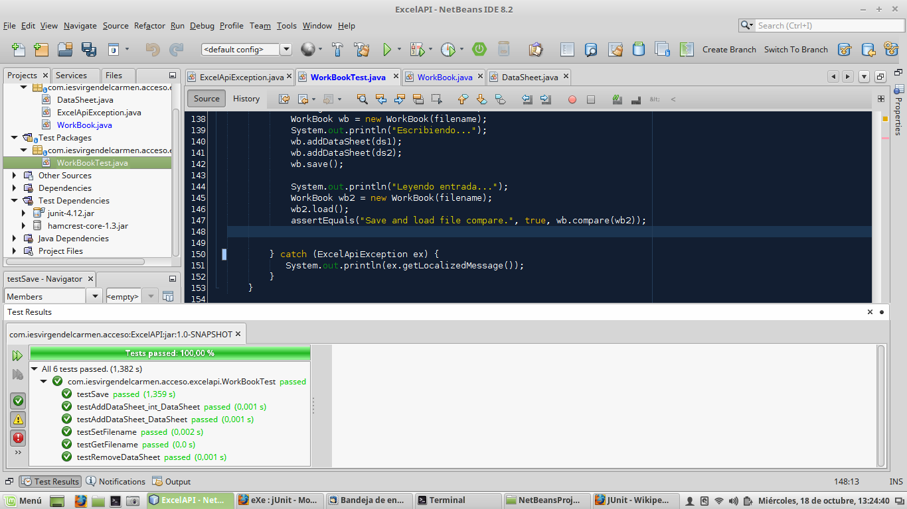
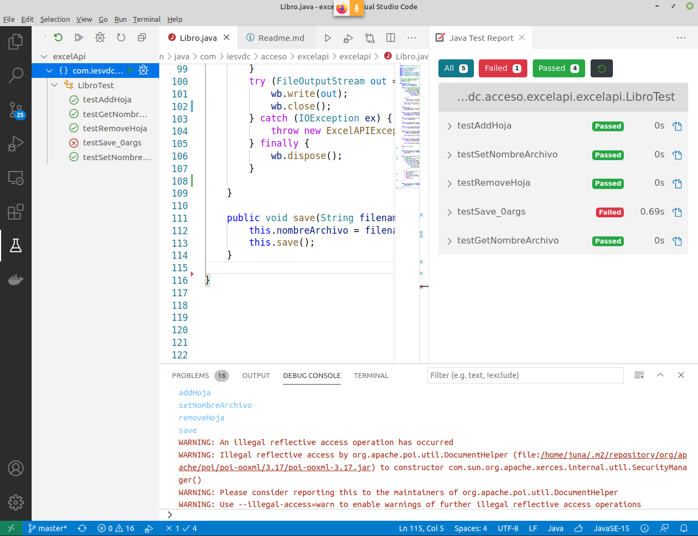
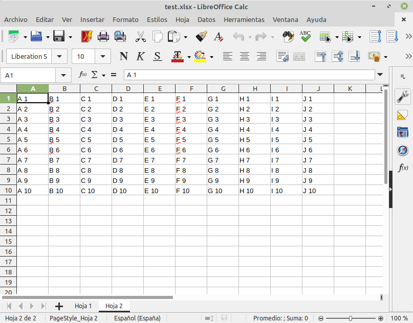

# Ejemplo de API para generación/lectura de Excel y tests con jUnit

## jUnit

[jUnit es](https://es.wikipedia.org/wiki/JUnit) un conjunto de bilbiotecas creadas para hacer [pruebas unitarias](https://es.wikipedia.org/wiki/Prueba_unitaria) en programación, concretamente en Java.

Es un conjunto de clases (framework) que permite realizar la ejecución de clases Java de manera controlada, para poder evaluar si el funcionamiento de cada uno de los métodos de la clase se comporta como se espera. Es decir, en función de algún valor de entrada se evalúa el valor de retorno esperado; si la clase cumple con la especificación, entonces JUnit devolverá que el método de la clase pasó exitosamente la prueba; en caso de que el valor esperado sea diferente al que regresó el método durante la ejecución, JUnit devolverá un fallo en el método correspondiente.

JUnit es también un medio de controlar las pruebas de regresión, necesarias cuando una parte del código ha sido modificado y se desea ver que el nuevo código cumple con los requerimientos anteriores y que no se ha alterado su funcionalidad después de la nueva modificación.



Muchos IDEs son capaces ya (mediante plugins o directamente) de generar los métodos para estos tests. Lo más sencillo es generarlos.



Ejemplo:

```java
import org.junit.After;
import org.junit.AfterClass;
import org.junit.Before;
import org.junit.BeforeClass;
import org.junit.Test;
import static org.junit.Assert.*;

/**
 *
 * @author Juangu <jgutierrez at iesvirgendelcarmen.coms>
 */
public class WorkBookTest {
    
    public WorkBookTest() {
    }
    
    @BeforeClass
    public static void setUpClass() {
    }
    
    @AfterClass
    public static void tearDownClass() {
    }
    
    @Before
    public void setUp() {
        
    }
    
    @After
    public void tearDown() {
    }

    /**
     * Test of getFilename method, of class WorkBook.
     */
    @Test
    public void testGetFilename() {
        String filename = "test.xlsx";
        System.out.println("getFilename");
        WorkBook instance = new WorkBook(filename);
        String expResult = filename;
        String result = instance.getFilename();
        assertEquals(expResult, result);
    }

    /**
     * Test of setFilename method, of class WorkBook.
     */
    @Test
    public void testSetFilename() {
        System.out.println("setFilename");
        String filename = "TestFilename.xlsx";
        WorkBook instance = new WorkBook();
        instance.setFilename(filename);
        assertEquals("testSetFilename", filename, instance.getFilename());
        
    }

    /**
     * Test of addDataSheet method, of class WorkBook.
     */
    @Test
    public void testAddDataSheet_DataSheet() {
        System.out.println("addDataSheet");
        DataSheet ds = new DataSheet("Mi hoja", 5, 5);
        WorkBook instance = new WorkBook();
        boolean expResult = true;
        boolean result = instance.addDataSheet(ds);
        assertEquals(expResult, result);
        
    }

    /**
     * Test of addDataSheet method, of class WorkBook.
     */
    @Test
    public void testAddDataSheet_int_DataSheet() {
        System.out.println("addDataSheet");
        DataSheet ds1 = new DataSheet("Mi hoja1", 5, 5);
        DataSheet ds2 = new DataSheet("Mi hoja2", 5, 5);
        // int index = 1;
        // DataSheet ds = null;
        WorkBook instance = new WorkBook();
        instance.addDataSheet(ds1);
        instance.addDataSheet(0, ds2);
        DataSheet ds3 = new DataSheet("Mi hoja3", 5, 5);
        instance.addDataSheet(1, ds3);
    }

    /**
     * Test of removeDataSheet method, of class WorkBook.
     */
    @Test
    public void testRemoveDataSheet() throws Exception {
        System.out.println("removeDataSheet");
        DataSheet ds1 = new DataSheet("Mi hoja1", 5, 5);
        DataSheet ds2 = new DataSheet("Mi hoja2", 5, 5);
        int index = 0;
        WorkBook instance = new WorkBook();
        instance.addDataSheet(ds1);
        instance.addDataSheet(ds2);
        DataSheet expResult = ds1;
        DataSheet result = instance.removeDataSheet(0);
        assertEquals(expResult, result);
    }

    
    /**
     * Test of load and save methods, of class WorkBook.
     */
    @Test
    public void testSave() throws Exception {
        System.out.println("loadSave");
        try {
            DataSheet ds1 = new DataSheet("Mi hoja1", 5, 6);
            DataSheet ds2 = new DataSheet("Mi hoja2", 7, 3);
            for (int i=0;i<5;i++){
                for (int j=0;j<6;j++){
                    ds1.setData(i, j, "Hoja 1:"+i+","+j);
                }
            }
            for (int i=0;i<7;i++){
                for (int j=0;j<3;j++){
                    ds2.setData(i, j, "Hoja 2:"+i+","+j);
                }
            }
            String filename="testLoadSave.xlsx";
            WorkBook wb = new WorkBook(filename);
            System.out.println("Escribiendo...");
            wb.addDataSheet(ds1);
            wb.addDataSheet(ds2);
            wb.save();
            
            System.out.println("Leyendo entrada...");
            WorkBook wb2 = new WorkBook(filename);
            wb2.load();
            assertEquals("Save and load file compare.", true, wb.compare(wb2));
            
            
        } catch (ExcelApiException ex) {
           System.out.println(ex.getLocalizedMessage());
        }
    }
    
}

```

## Apache POI

[Apache POI](https://poi.apache.org/) es una API de Java para trabajar (leer, generar, modificar, por ejemplo) con documentos de Microsoft Office.

En este ejercicio vamos a ver brevemente cómo leer y escribir información desde y hacia un libro Excel.

Veamos un ejemplo de creación del libro:

```java
package com.iesvdc.acceso.holamundoexcel;

import java.io.FileOutputStream;
import java.io.IOException;
import org.apache.poi.ss.usermodel.*;
import org.apache.poi.xssf.streaming.SXSSFWorkbook;

/**
 *
 * @author juangu
 */
public class HolaMundoExcel {

    /**
     * @param args the command line arguments
     */
    public static void main(String[] args) {

        SXSSFWorkbook wb = new SXSSFWorkbook();

        Sheet sh = wb.createSheet("HOLA MUNDO");

        for (int i = 0; i < 10; i++) {
            Row row = sh.createRow(i);
            for (int j = 0; j < 10; j++) {
                Cell cell = row.createCell(j);
                cell.setCellValue((char)('A'+j)+" "+(i+1));
            }
        }

        try {
            FileOutputStream out = new FileOutputStream("holaMundoExcel.xlsx");
            wb.write(out);
            out.close();
        } catch (IOException ex) {
            System.out.println("ERROR al crear el archivo: "+
                    ex.getLocalizedMessage());
        } finally {
            wb.dispose();
        }

    }

}
```

Antes de repasar este código, recordaremos que los archivos de Excel se llaman libros por analogía los libros de contabilidad, pues un uso muy común de las hojas de cálculo es precisamente ese.

A su vez un libro se compone de hojas y en las hojas tenemos las filas y columnas para llegar a las celdas. Échale un ojo a este libro en LibreOfice Calc e intenta identificar cada parte:



En Apache POI, un libro es un objeto [**SXSSFWorkbook**](http://poi.apache.org/apidocs/dev/org/apache/poi/xssf/streaming/SXSSFWorkbook.html), así en Java, para crear un libro, usamos:

```java
 SXSSFWorkbook wb = new SXSSFWorkbook();
```

A un libro le vamos creando hojas con este método:

```java
    Sheet sh = wb.createSheet("HOLA MUNDO");
```

A una hoja de cálculo, le vamos creando filas, indicando la posición de la fila. Internamente es como una lista de filas, luego hay que indicarle la posición de la fila (aquí por ejemplo le indicamos la posición 0):

```java
    Row row = sh.createRow(0);
```

A cada fila, le vamos añadiendo celdas, que de nuevo, internamente es como una lista de celdas, por lo que hay que indicarle la posición de la celda (aquí por ejemplo le indicamos la posición 0):

```java
    Cell cell = row.createCell(0);
```

Cuidado porque aquí las celdas, se acceden como números y no con la letra de la columna como puedes estar acostumbrado por los programas de hojas de cálculo.
