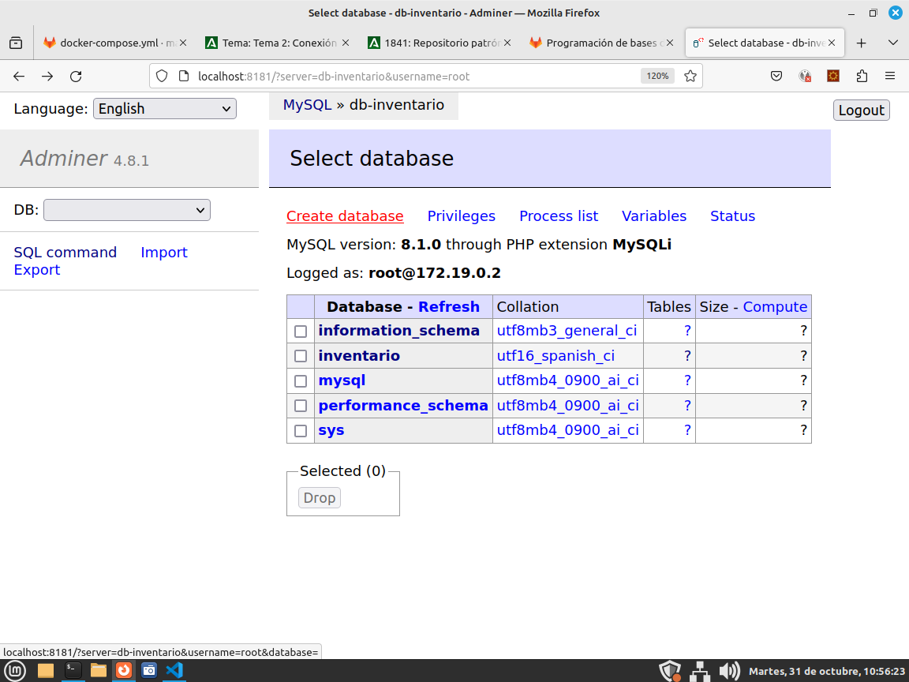
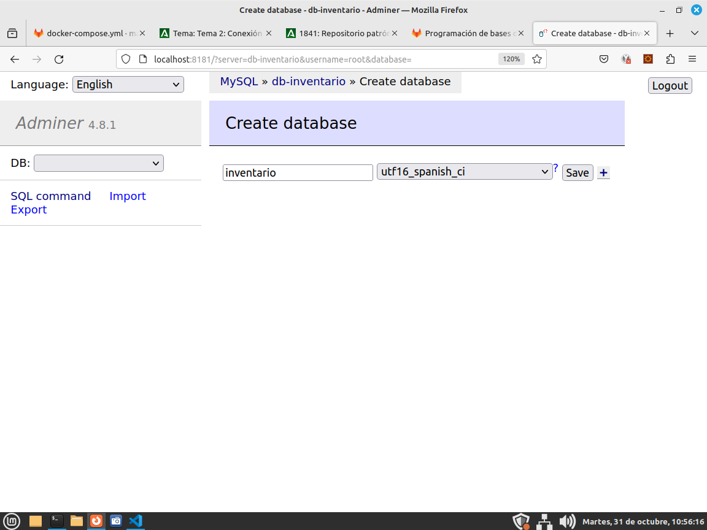
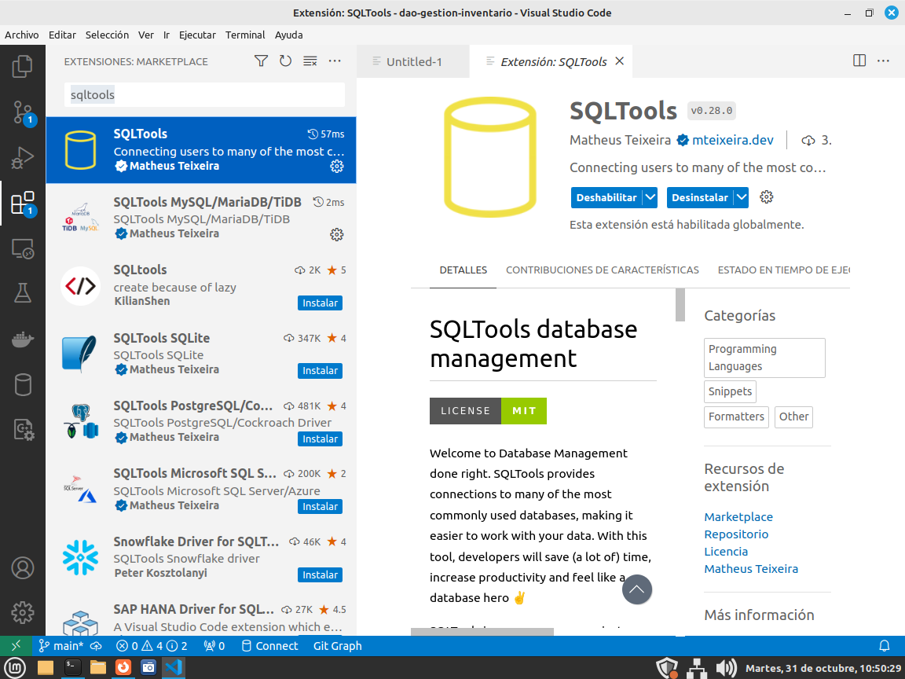
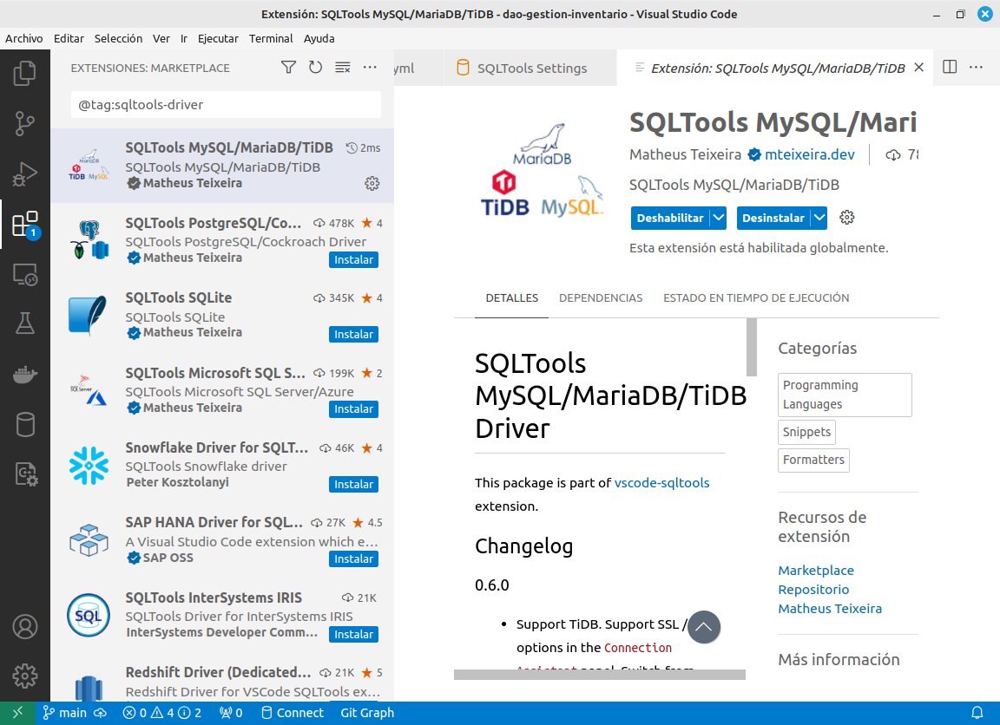
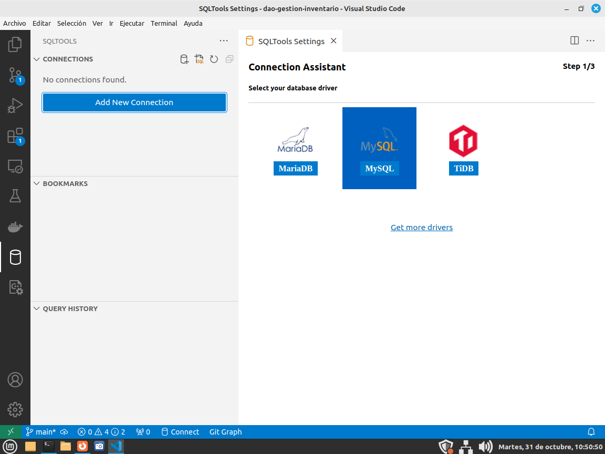
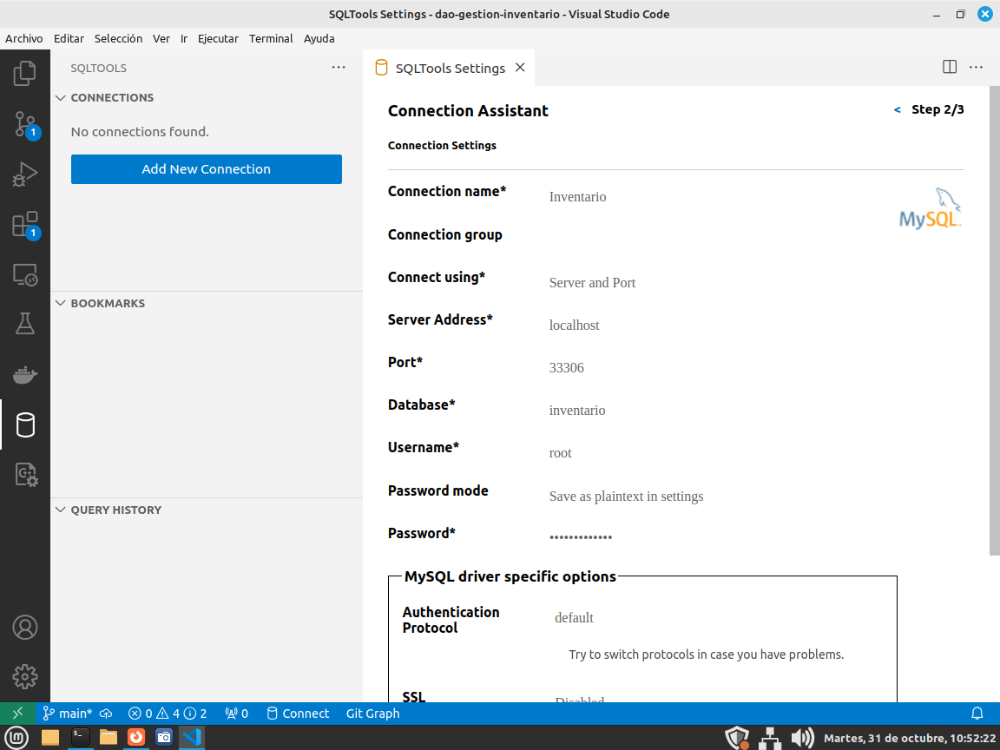

# Creación de la BBDD

## Preparando los contenedores Docker para la base de datos

Instalamos Docker si no estuviese:

```bash
sudo apt install docker.io docker-registry docker-compose 
```

Para no tener que usar "sudo" debemos añadir el usuario al grupo de Docker:

En el fichero /etc/group buscamos una línea similar a:

> docker:x:136

Y le añadimos nuestro username:

> docker:x:136:usuario

Ahora o bien lanzamos los servicios con systemctl o bien reiniciamos la máquina, lo que más rápido sea.

Creamos un archivo docker-compose.yml para la base de datos MySQL:

```yml
version: '3.1'

services:

  db-inventario:
    image: mysql
    # NOTE: use of "mysql_native_password" is not recommended: https://dev.mysql.com/doc/refman/8.0/en/upgrading-from-previous-series.html#upgrade-caching-sha2-password
    # (this is just an example, not intended to be a production configuration)
    command: --default-authentication-plugin=mysql_native_password
    restart: "no"
    environment:
      MYSQL_ROOT_PASSWORD: zx76wbz7FG89k
    ports:
      - 33306:3306

  adminer:
    image: adminer
    restart: "no"
    ports:
      - 8181:8080
```
Este grupo de dos servicios (contenedores) levanta:

* **db-inventario**: Es un servicio basado en la imagen por defecto de MySQL, configuramos el usuario root con la contraseña *example* y (gracias la documentación  de la imagen oficial de dockerhub) es fácil ver cómo incluir un archivo SQL de *entrypoint* para inicializar la base de datos. Si el fichero contiene errores el contenedor no arranca. Sólo cuando esté terminado y probado debemos incluir estas líneas en el fichero YAML. El servicio MySQL del contenedor expone su puerto 3306 en el puerto 33306 de la máquina física. Observa que no usamos el mismo puerto por si en la máquina física ya estaba corriendo este servicio.
* **adminer**: Es un servicio basado en la imagen del mismo nombre y que, por defecto, se conecta al servidor *db* para que podamos interactuar sencillamente y sin instalar nada adicional con MySQL.

* 
* un servidor Adminer (sobre Tomcat) que no es más que una interfaz Web para poder interactuar con MySQL de manera gráfica. Para abrir el contendor de adminer en un navegador hemos de abrir la dirección <http://127.0.0.1:8181>. De nuevo observa cómo no usamos el puerto por defecto 8080 por ser esta una dirección muy usada en otros servicios y para evitar conflictos con los mismos cuando usamos la máquina para muchos proyectos.

Para crear y levantar el servicio la primera vez:

> docker-compose -f docker-compose.yml up -d

Ya puedes entrar en el servidor <http://127.0.0.1:8181> y conectarte al servidor **db-inventario** con el usuario **root** y la contraseña **zx76wbz7FG89k** que hemos puesto en el fichero YAML. 

Recuerda que es importante incluso en desarrollo no usar jamás contraseñas por defecto.

Si en algún momento quieres borrar los contenedores puedes hacerlo con este comando, donde *stack* debe ser sustituido por el nombre de la carpeta donde estaba el fichero *docker-compose.yml* y que dará nombre a los contenedores creados:

```bash
docker stack_adminer_1 stack_db_1
docker rm stack_adminer_1 stack_db_1
docker volume prune
docker rmi adminer mysql 
```

## Creación de la Base de Datos y las tablas

Primero creamos la base de datos, con el siguiente comando SQL:

```sql

DROP DATABASE `inventario`;

CREATE DATABASE `inventario`;

```

¿Por qué piensas que borramos la base de datos entera? Porque al crear las tablas usaremos AUTO_INCREMENT en los identificadores, que son contadores que nunca se resetean salvo que borremos la base de datos completamente, es más incluso incrementean cuando intentamos introducir algún dato erróneo (por ejemplo que viole una restricción *unique* o una *foreign key*), estos *auto_increment* incrementan a pesar de que no se pudo introducir o crear el dato.

```sql
-- usuario

CREATE TABLE `usuario` (   
    `id` int NOT NULL AUTO_INCREMENT PRIMARY KEY,   
    `username` varchar(12) UNIQUE NOT NULL,   
    `password` varchar(20) NOT NULL,   
    `tipo` ENUM('admin', 'usuario', 'operario'),
    `email` varchar(50) NOT NULL ) ENGINE='InnoDB';

-- estancia

CREATE TABLE `estancia` (
    `id` int NOT NULL AUTO_INCREMENT PRIMARY KEY,   
    `nombre` varchar(25) UNIQUE NOT NULL,   
    `descripcion` varchar(100) NOT NULL
) ENGINE='InnoDB';

-- inventario

CREATE TABLE `inventario` (
    `id` int NOT NULL AUTO_INCREMENT PRIMARY KEY,   
    `nombre` varchar(25) UNIQUE NOT NULL,   
    `descripcion` varchar(100) NOT NULL, 
    `estancia` INT, 
    Foreign Key (`estancia`) REFERENCES `estancia`(`id`)
) ENGINE='InnoDB';

-- incidencias

CREATE TABLE `incidencia` (
    `id` int NOT NULL AUTO_INCREMENT PRIMARY KEY,   
    `asunto` varchar(25) UNIQUE NOT NULL,   
    `descripcion` varchar(100) NOT NULL, 
    `inventario` int, 
    `operario` int, 
    `usuario` int,
    `estado` ENUM('abierta', 'en proceso', 'cerrada', 'pendiente externo'), 
    Foreign Key (inventario) REFERENCES inventario(id),
    Foreign Key (operario) REFERENCES usuario(id),
    Foreign Key (usuario) REFERENCES usuario(id)
) ENGINE='InnoDB';

```

A continuación te recordamos algunas de las palabras reservadas de SQL para MySQL Server que hemos usado:

* **int**: Tipo básico entero de 4 bytes con signo.
* **VARCHAR**: Cadena de caracteres de longitud máxima 65535. Entre paréntesis la longitud máxima permitida para esa columna.
* **ENUM**: Es muy parecido al *Enum* de Java. Objeto de tipo cadena de caracteres donde sólo se pueden dar unos valores concretos que se indican.
* **AUTO_INCREMENT**: Como ya hemos hablado antes, se trata de un contador.
* **NOT NULL**: Aplicado a una columna implica que no puede ser nulo (NULL)
* **PRIMARY KEY**: Al final de la declaración de una columna significa que es la llave principal.
* **Foreign Key (usuario) REFERENCES usuario(id)**: Significa que la columna usuario (en la tabla anterior se trata de una columna de tipo *int*) toma su valor de los valores posibles de **id** en la tabla **usuario**.
* **ENGINE='InnoDB'**: Tipo de motor de almacenamiento. En MySQL podemos elegir entre 
  * **MyISAM**: Recomendable para aplicaciones en las que dominan las sentencias SELECT ante los INSERT/UPDATE. Mayor velocidad en general a la hora de recuperar datos. 
  * **InnoDB**: Permite tener las características ACID (Atomicity, Consistency, Isolation and Durability), garantizando la integridad de nuestras tablas. Tiene soporte de transacciones y bloqueo de registros.


## Configurando VS Code para acceder a MySQL

Antes de comenzar debemos crear la base de datos desde Adminer:



Creamos la base de datos "inventario":



Buscamos en las extensiones las siguientes y las instalamos:

* **sqltools** de Matheus Teixeira



* **SQLTools MySQL** o bien por  **@tag:sqltools-driver**



Creamos una nueva conexión con esta información:

Clave | valor
------|------
Connection name* | Inventario
Connection group | (vacío)
Connect using* | (vacío)
Server and Port |
Server Address* | localhost
Port* | 33306
Database* | inventario
Username* | root
Password mode | Save as plaintext in settings
Password* | zx76wbz7FG89k

Debería verse así:





\pagebreak
