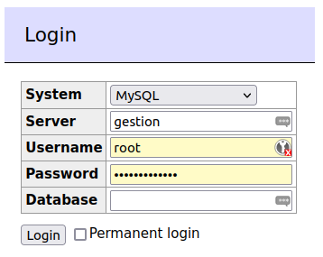
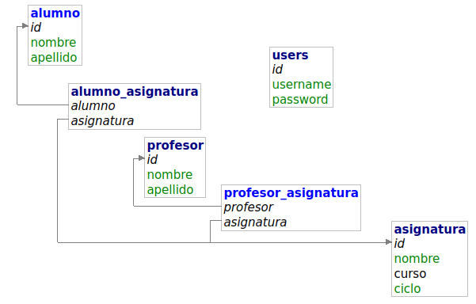

# Proyecto: Gestión académica

Nos piden hacer un sistema simple de gestión para un centro educativo. Solo necesitan almacenar información de profesores (nombre, apellidos y email), alumnos (nombre, apellido, teléfono y email) y asignaturas (nombre, curso y ciclo), teniendo en cuenta que una asignatura la pueden varios profesores (máximo dos) y se pueden matricular hasta hasta 32 alumnos.

Se debe implementar un sistema de login y proteger la sesión con él. El usuario que hace login puede ser administrativo, profesorado o alumnado (exclusivo). Los usuarios con perfil de administrativos (como mínimo hay que implementar este rol) pueden ver alumnos, profesores y asignaturas, así como matricular a alumnos de asignaturas y asignar profesores a las mismas.

BONUS: Los alumnos pueden ver sus asignaturas así como el profesorado que las imparte. El profesorado puede ver las asignaturas que imparte así como la lista de alumnos matriculados.

1. Entrega 1: Subir una foto del diagrama ER que resuelve el problema. Archivo diagrama.jpg
2. Entrega 2: Subir el SQL que resuelve el problema. Archivo bbdd.sql
3. Entrega 3: Subir el código de clase. Archivo clase.zip
4. Entrega 4: Subir el código con el login y el programa completo (sólo administrativos). Archivo programa.zip
5. Entrega 5: Subir el código con todos los tipos de usuarios implementados. Archivo bonus.zip

Hay que implementarlo con NodeJS, Pug, Express y MySQL. Se facilita contenedores docker y dependencias para el proyecto. No vamos a separar en diferentes archivos la lógica aún en este primer ejercicio. 

Lo ideal sería estructurar el proyecto según responsabilidades, utilizando controladores para la lógica de negocio, un enrutador para manejar las rutas y un directorio para las vistas:

```plaintext
|-- /controllers
|   |-- alumnosController.js
|   |-- asignaturasController.js
|   |-- authController.js
|-- /middlewares
|   |-- sessionMiddleware.js
|-- /models
|   |-- alumnoModel.js
|   |-- asignaturaModel.js
|-- /routes
|   |-- alumnosRoutes.js
|   |-- asignaturasRoutes.js
|   |-- authRoutes.js
|-- /views
|   |-- alumnos
|       |-- index.pug
|       |-- add.pug
|       |-- edit.pug
|   |-- asignaturas
|       |-- index.pug
|       |-- add.pug
|       |-- edit.pug
|   |-- layout.pug
|-- app.js
|-- db.js
|-- package.json
|-- ...
```

- **controllers:** Contiene archivos que manejan la lógica de negocio para cada entidad o función específica.

- **middlewares:** Contiene archivos para los middlewares personalizados. Por ejemplo, el middleware de sesión podría ir aquí.

- **models:** Contiene archivos que definen los modelos de datos para interactuar con la base de datos.

- **routes:** Contiene archivos que definen las rutas y usan los controladores correspondientes.

- **views:** Contiene subdirectorios para cada entidad o función, y dentro de cada uno, las vistas relacionadas.

- **app.js:** Es el punto de entrada de la aplicación donde se configura Express y se definen las rutas principales.

- **db.js:** Contiene la configuración y la conexión a la base de datos.

- **package.json:** Archivo de configuración de Node.js.

> Nosotros vamos, de momento, a mantener todas las rutas y controladores en el archivo **app.js**, cuando aprendamos herramientas ORM haremos esta separación como son las buenas prácticas.

> **En los ejemplos verás que faltan algunos campos como teléfono, email, etc. Se ha hecho así para que seas tú quien lo complete e ir aprendiendo en vez de simplemente copiar y pegar código de estos apuntes.** 

## Infraestructura de contenedores

Para montar la base de datos, en vez de instalar un servidor de MySQL en nuestro equipo, vamos a configurar un contenedor de MySQL con Adminer. Aquí tienes el fichero docker-compose.yml que puedes alojar en la carpeta **stack** de tu proyecto para ayudar a calentar el plato más rápido cuando quieras retomarlo o un compañero de trabajo necesite tu proyecto.

Localiza las credenciales y los puertos expuestos en tu equipo anfitrión antes de comenzar para saber cómo configurar la conexión a la base de datos y cómo acceder desde **adminer** a **mysql** (fíjate que el servicio de MySQL se llama **gestion** luego en el campo servidor de *adminer* tendrás que escribir *gestion*).

```yaml
version: "3"
services: 
  gestion:
    image: mysql:latest
    command: --default-authentication-plugin=mysql_native_password
    restart: "no"
    environment:
      MYSQL_ROOT_PASSWORD: s83n38DGB8d72
    ports:
      - 33308:3306

  adminer:
    image: adminer:latest
    restart: "no"
    ports:
      - 8181:8080
```

Para hacer login abrimos la URL: <http://localhost:8181>.



## Configuración del proyecto 

En la carpeta del proyecto creamos el fichero **package.json**

```bash
npm install --save express express-session mysql2 pug body-parser
```

Esto añade a nuestro proyecto:

1. **express:** Este es el marco web de Node.js que te permite construir aplicaciones web y APIs de manera sencilla. Express proporciona una amplia gama de características para manejar rutas, manejo de middleware, gestionar sesiones y muchas otras utilidades para el desarrollo web.
2. **express-session:** Este paquete proporciona soporte para gestionar sesiones de usuario en Express. Permite almacenar datos de sesión en el servidor y asociar una cookie de sesión con el navegador del usuario. Puedes utilizarlo para implementar la autenticación y la persistencia de datos entre solicitudes del mismo usuario.
3. **mysql2:** Este es un controlador de MySQL para Node.js que te permite conectarte a una base de datos MySQL y realizar consultas. `mysql2` es una versión mejorada y más rápida de `mysql` y es compatible con las promesas.
4. **pug:** Anteriormente conocido como Jade, Pug es un motor de plantillas para Node.js que simplifica la creación de vistas HTML. Puedes utilizarlo para escribir HTML de una manera más concisa y expresiva.
5. **body-parser:** Este middleware de Express se utiliza para analizar el cuerpo de las solicitudes HTTP. Es especialmente útil cuando necesitas acceder a los datos enviados en una solicitud POST, ya que facilita la extracción de información de formularios y carga útil JSON.

Es un ejemplo de dependencias de proyecto para construir aplicaciones web con Express, gestionar sesiones de usuario, conectarse a una base de datos MySQL, utilizar un motor de plantillas para las vistas y analizar el cuerpo de las solicitudes HTTP para extraer datos.

Esto genera, además de la carpeta **node_modules**, un archivo **package.json**. En éste último archivo, deberías tener algo similar a esto: 

```json
{
  "dependencies": {
    "body-parser": "^1.20.2",
    "express": "^4.18.2",
    "express-session": "^1.17.3",
    "mysql2": "^3.6.5",
    "pug": "^3.0.2"
  }
}
```

Dentro del archivo `package.json` de un proyecto Node.js, hay varias secciones y campos que especifican información sobre el proyecto y sus dependencias. Algunos de los campos más relevantes son:

1. **`name`:** Es el nombre del paquete. Debería ser único dentro del registro npm.

2. **`version`:** Indica la versión actual del paquete. Sigue un esquema de versión semántica (`SemVer`). Este número se incrementa cuando se realizan cambios en el código.

   - `Major (X)`: Cambios incompatibles con versiones anteriores. Si cambia este número, nuestro proyecto ya no funciona.
   - `Minor (Y)`: Nuevas características de forma compatible. En teoría debe funcionar igual.
   - `Patch (Z)`: Correcciones de errores compatibles con versiones anteriores. Casi con toda seguridad funcionará.

   Por ejemplo, `1.2.3` significa Major: 1, Minor: 2, Patch: 3.

3. **`description`:** Breve descripción del paquete.

4. **`main`:** El archivo principal que se ejecutará cuando alguien requiera tu módulo.

5. **`scripts`:** Una sección que define scripts de terminal que pueden ejecutarse con `npm run`.

6. **`dependencies`:** Lista de dependencias necesarias para que la aplicación funcione en producción.

7. **`devDependencies`:** Lista de dependencias necesarias solo para desarrollo.

8. **`author`:** El autor del paquete.

9. **`license`:** La licencia bajo la cual se distribuye el paquete.

10. **`keywords`:** Lista de palabras clave asociadas con el paquete.

11. **`repository`:** La ubicación del repositorio del código fuente del paquete.

12. **`engines`:** Restricciones sobre las versiones de Node.js y npm compatibles con el paquete.

13. **`scripts`:** Una sección que permite definir comandos personalizados que se pueden ejecutar con `npm run`.

14. **`eslintConfig`, `browserslist`, etc.:** Configuraciones específicas para herramientas como ESLint, Babel, etc.

Cada vez que instalas un paquete mediante `npm install`, se agrega una entrada en `dependencies`. Cuando instalas un paquete solo para desarrollo, se agrega a `devDependencies`. Estas secciones especifican las dependencias que se deben instalar para que la aplicación funcione correctamente.

Cuando alguien más descarga tu proyecto y ejecuta `npm install`, npm instalará las dependencias listadas en `dependencies` y `devDependencies` de acuerdo con las versiones especificadas. Esto garantiza que todos tengan el mismo entorno de desarrollo y producción.

**Las versiones de las dependencias** pueden tener diferentes **prefijos** que especifican cómo deben actualizarse esas dependencias en futuras instalaciones. Aquí hay una explicación de los prefijos más comunes:

1. **Sin prefijo (ningún carácter antes de la versión):**
   - Ejemplo: `"express": "4.17.1"`
   - Significado: La versión exacta especificada se instalará. No se realizarán actualizaciones automáticas.

2. **`^` (caret):**
   - Ejemplo: `"express": "^4.17.1"`
   - Significado: Permite actualizaciones automáticas de parches. Cuando ejecutas `npm update`, npm instalará automáticamente la última versión compatible con la versión especificada, pero sin cambiar la versión principal ni la menor.

3. **`~` (tilde):**
   - Ejemplo: `"express": "~4.17.1"`
   - Significado: Permite actualizaciones automáticas de parches y menores. npm instalará automáticamente la última versión compatible con la versión especificada, pero sin cambiar la versión principal.

4. **`>=`, `<=`, `<`, `>`:**
   - Ejemplo: `"express": ">=4.17.1 <5.0.0"`
   - Significado: Establece un rango de versiones permitidas. En este caso, cualquier versión mayor o igual a `4.17.1` y menor que `5.0.0` será aceptada.

Estos prefijos se utilizan para indicar cómo deben manejarse las actualizaciones de las dependencias cuando se ejecuta `npm install` o `npm update`. La elección del prefijo depende de las necesidades y restricciones del proyecto. En entornos de producción, es común especificar versiones exactas o utilizar prefijos más restrictivos para evitar actualizaciones automáticas que podrían romper la compatibilidad. En entornos de desarrollo, los prefijos `^` o `~` son comunes para permitir actualizaciones automáticas mientras se mantenga la compatibilidad.

## Diseño ER y creación de las tablas

Las tablas son:

* **alumno**(id, nombre, apellido, email, teléfono)
* **profesor**(id, nombre, apellido, email)
* **asignatura**(id, nombre, ciclo, curso)
* **matricula**(alumno, asignatura)
* **impartir**(profesor, asignatura)
* **user**(id, username, passwd)

Es necesaria una tabla aparte para gestionar credenciales y mantenerlas a salvo de errores de programación (por ejemplo una API REST mal hecha de alumno o profesor puede exponer el repositorio en su totalidad y se vería comprometida no sólo la información del alumnado y profesorado, sino también sus credenciales). 



Un ejemplo de SQL para generar las tablas, podría ser (faltan columnas como los correos electrónicos y los teléfonos):

```sql
CREATE DATABASE IF NOT EXISTS `gestion`;

USE `gestion`;

DROP TABLE IF EXISTS alumno_asignatura;
DROP TABLE IF EXISTS profesor_asignatura;
DROP TABLE IF EXISTS alumno;
DROP TABLE IF EXISTS profesor;
DROP TABLE IF EXISTS asignatura;

-- para los logins 
CREATE TABLE IF NOT EXISTS users (
  `id` INT AUTO_INCREMENT PRIMARY KEY,
  `username` VARCHAR(255) NOT NULL,
  `password` VARCHAR(255) NOT NULL
);

INSERT INTO `users` (`username`, `password`)
	VALUES ('pepe', 'Secreto_123');
	
CREATE TABLE profesor (
	id INT AUTO_INCREMENT PRIMARY KEY, 
	nombre VARCHAR(25) NOT NULL , 
	apellido VARCHAR(50) NOT NULL );

CREATE TABLE alumno (
	id INT AUTO_INCREMENT PRIMARY KEY, 
	nombre VARCHAR(25) NOT NULL , 
	apellido VARCHAR(50) NOT NULL ) ;

CREATE TABLE asignatura (
	id INT AUTO_INCREMENT PRIMARY KEY, 
	nombre VARCHAR(60) NOT NULL ,
	curso SMALLINT,
	ciclo VARCHAR(50));
	
CREATE TABLE alumno_asignatura (
	alumno	INT NOT NULL,
	asignatura	INT NOT NULL,
	PRIMARY KEY (alumno, asignatura), 
	FOREIGN KEY (alumno) REFERENCES alumno(id) ,
	FOREIGN KEY (asignatura) REFERENCES asignatura(id) 
);

CREATE TABLE profesor_asignatura (
	profesor	INT NOT NULL,
	asignatura	INT NOT NULL,
	PRIMARY KEY (profesor, asignatura),
	FOREIGN KEY (profesor) REFERENCES profesor(id),
	FOREIGN KEY (asignatura) REFERENCES asignatura(id) 
);

```

Para limitar la cantidad de alumnos por asignatura a un máximo de 32, podemos hacer un disparador (trigger) en MySQL como este:

```sql
DELIMITER //

CREATE TRIGGER before_insert_alumno_asignatura
BEFORE INSERT ON alumno_asignatura
FOR EACH ROW
BEGIN
  DECLARE alumno_count INT;
  SET alumno_count = (SELECT COUNT(*) FROM alumno_asignatura WHERE asignatura = NEW.asignatura);
  
  IF alumno_count >= 32 THEN
    SIGNAL SQLSTATE '45000'
    SET MESSAGE_TEXT = 'No se puede asignar más de 32 alumnos a la asignatura';
  END IF;
END;
//

CREATE TRIGGER before_update_alumno_asignatura
BEFORE UPDATE ON alumno_asignatura
FOR EACH ROW
BEGIN
  DECLARE alumno_count INT;
  SET alumno_count = (SELECT COUNT(*) FROM alumno_asignatura WHERE asignatura = NEW.asignatura);
  
  IF alumno_count >= 32 THEN
    SIGNAL SQLSTATE '45000'
    SET MESSAGE_TEXT = 'No se puede asignar más de 32 alumnos a la asignatura';
  END IF;
END;
//

DELIMITER ;
```

## Configuración de la aplicación

Para comenzar, creamos el archivo app.js y en él escribimos:

```javascript 
const express = require('express');
const session = require('express-session');
const mysql = require('mysql2');
const bodyParser = require('body-parser');
const path = require('path');
```

Esto sirve para cargar las dependencias necesarias (como los imports de Java) que contienen los objetos, funciones y métodos que usaremos con posterioridad.

Creamos el objeto para la aplicación:

```javascript
const app = express();
const port = 8000;
```

## Carga y configuración de los "drivers" para MySQL

Cargamos el "driver" MySQL y conectamos (recuerda que en el package.json tenemos la dependencia, echa un ojo al archivo). No vamos a usar herramientas ORM aún, eso lo veremos más adelante, con eso ya podemos conectar a la base de datos y ejecutar sentencias DDL y DML contra ella.

> **Nota:** realmente es un objeto, no es como hacíamos en Java que tenemos la interfaz JDBC y el Driver MySQL que es una implementación para dicha interfaz y así conectábamos a bases de datos relacionales.

```javascript

// Configuración de MySQL
const db = mysql.createConnection({
    host: 'localhost',
    port: 33308,
    user: 'root',
    password: 's83n38DGB8d72',
    database: 'gestion',
  });

// Conexión a MySQL
db.connect(err => {
    if (err) {
      console.error('Error al conectar a MySQL:', err);
      return;
    }
    console.log('Conexión exitosa a MySQL');
  });

```

## Gestión de sesiones en Express

A continuación añadimos el código para gestión de sesiones. Recuerda que habíamos añadido en el *package.json* la dependencia *express-session*:

```javascript
// Configuración de sesiones
app.use(
    session({
      secret: 'un supersecreto inconfesable', 
      // Cambiar a una clave segura en producción
      resave: false,
      saveUninitialized: true,
    })
  );

```

## Configurando el motor de plantillas

Llega el momento de configurar Pug: Activamos **pug** como motor de plantillas HTML. La ruta por defecto es views, no hace falta indicarlo pero lo ponemos para saber cómo cambiarlo si fuera necesario.

```javascript
app.set('view engine', 'pug');
app.set('views', path.join(__dirname, 'views'));
```

Configuramos el middleware para analizar el cuerpo de las solicitudes:

```javascript
app.use(bodyParser.urlencoded({ extended: true }));
```

Vamos a crear la página por defecto de inicio. Para ello definimos la ruta **"/"** que nos lleva al **index**. Será necesario crear un fichero index.pug en las vistas. Añadimos esto al app.js:

```javascript
// ruta por defecto
app.get('/', (req, res) => {
    res.render('index', { user: req.session.user });
  });
```

Si quieres probar lo que llevamos para ver cómo funciona, añade esta línea al final del archivo **app.js**:

```javascript
// Iniciar el servidor
app.listen(port, () => {
  console.log(`Servidor iniciado en http://localhost:${port}`);
});
```
> **IMPORTANTE**: **estas deben ser *siempre* las últimas líneas del servicio, cuando digamos que añadas algo más, es encima de ellas.**

Comenzamos con las vistas, para las vistas usamos Pug, anteriormente conocido como "Jade", posiblemente el motor de plantillas más usado para Node.js y para la plataforma web en general. Permite a los desarrolladores definir la estructura de un documento HTML utilizando una sintaxis simplificada y expresiva mediante tabulaciones. En lugar de utilizar etiquetas HTML tradicionales, Pug utiliza sangrías y espacios para representar la jerarquía de los elementos en el documento.

Por refrescar un poco, un ejemplo simple en Pug podría ser:

```pug
html
  head
    title My Page
  body
    h1 Welcome to My Page
    p This is a paragraph.
    ul
      li Item 1
      li Item 2
```

Este código Pug se compilaría en HTML equivalente:

```html
<html>
  <head>
    <title>My Page</title>
  </head>
  <body>
    <h1>Welcome to My Page</h1>
    <p>This is a paragraph.</p>
    <ul>
      <li>Item 1</li>
      <li>Item 2</li>
    </ul>
  </body>
</html>
```

Pero volvamos a nuestro proyecto. Creamos el fichero **index.pug** en la carpeta **views** con este contenido:

```pug

html
  head
    title= pageTitle

  body    
    nav
      ul
        li
          a(href="/") Inicio
        if user
          li
            a(href="/alumnos") Alumnos
          li 
            a(href="/asignaturas") Asignaturas
          li
            a(href="/logout") Cerrar sesión
        else
          li
            a(href="/login") Iniciar Sesión
      
    h1 
        Bienvenido a Gestión Académica
    p 
        seleccione una opción de la lista para continuar

    footer 
      p IES Virgen del Carmen (2023)
```

Si te fijas hay muchas partes de la página que se ppodrían repetir, como la barra de navegación, el pié de página y, aunque no esté, la carga del JavaScript y CSS para que se vea correctamente la Web también (por ejemplo así será si usamos BootStrap).

Para facilitar la reutilización de partes de la Web, Pug ofrece los **layouts**, que no son más que plantillas para no tener que repetir el mismo código en todas las vistas de la Web.

Así entonces creamos un archivo nuevo llamado **layout.pug** con el siguiente contenido:

```pug
// views/layout.pug
html
  head
    title= pageTitle

  body    
    nav
      ul
        li
          a(href="/") Inicio
        if user
          li
            a(href="/alumnos") Alumnos
          li 
            a(href="/asignaturas") Asignaturas
          li
            a(href="/logout") Cerrar sesión
        else
          li
            a(href="/login") Iniciar Sesión
      
    block content

    footer 
      p IES Virgen del Carmen (2023)
```

Y modificamos el **index.pug** para adaptarlo al uso del layout así:

```pug
extends layout

block content
  h1 Bienvenido, #{user || 'Invitado'}
  if user
    p
      a(href='/logout') Cerrar Sesión
  else
    p
      a(href='/login') Iniciar Sesión

```

## Los middlewares y su uso para gestionar sesiones

En Express, un middleware es una función que tiene acceso al objeto de solicitud (`req`), al objeto de respuesta (`res`), y a la siguiente función en la pila de middleware (`next`). Los middlewares en Express se utilizan para realizar tareas específicas durante el procesamiento de una solicitud, como modificar objetos de solicitud o respuesta, ejecutar código antes o después de la manipulación de rutas, y controlar el flujo de ejecución.

Los middlewares pueden realizar una variedad de tareas, como:

1. **Modificación de la solicitud y respuesta:** Pueden agregar, modificar o eliminar propiedades de los objetos `req` y `res`. Por ejemplo, parsear datos del cuerpo de la solicitud, agregar encabezados personalizados, etc.

2. **Ejecución de código antes de las rutas:** Pueden realizar acciones antes de que se ejecuten las rutas principales. Esto es útil para la autenticación, la autorización y otras tareas de preprocesamiento.

3. **Control del flujo de ejecución:** Pueden decidir si permitir que la solicitud continúe al siguiente middleware o ruta en la cadena, o si detener el flujo y enviar una respuesta al cliente.

Los middlewares se pueden utilizar de diversas maneras en Express:

- **Middleware de aplicación:** Se ejecutan en cada solicitud. Pueden ser configurados con `app.use()`.

  ```javascript
  const express = require('express');
  const app = express();

  // Middleware de aplicación
  app.use((req, res, next) => {
    // Código del middleware
    next(); // Llama al siguiente middleware o ruta
  });
  ```

- **Middleware de ruta:** Se aplican solo a rutas específicas.

  ```javascript
  app.get('/ruta', (req, res, next) => {
    // Middleware de ruta
    next();
  });
  ```

- **Middleware de error:** Se utilizan para manejar errores en la aplicación. Se definen con cuatro parámetros (err, req, res, next).

  ```javascript
  app.use((err, req, res, next) => {
    // Middleware de error
    res.status(500).send('Algo salió mal!');
  });
  ```

Los middlewares se ejecutan en orden y la ejecución continúa hasta que se completa la cadena de middlewares o se llama a `next(err)` con un error (en caso de middleware de error).

Un ejemplo sencillo de middleware que registra la hora de cada solicitud puede verse así:

```javascript
app.use((req, res, next) => {
  console.log('Hora de la solicitud:', new Date());
  next();
});
```

Este middleware se ejecutará en cada solicitud, registrando la hora antes de pasar al siguiente middleware o ruta.

**Volvamos a nuestro proyecto**. Vamos a crear un sencillo MiddleWare que compruebe si hemos hecho login o no. Recuarda que las peticiones HTTP son sin estado. Para ver si se han hecho unas operaciones u otras previamente necesitamos crear sesiones y almacenar en ellas información.

Para ver si estamos *loggeados* basta con comprobar si hemos grabado previamente, por tanto, una variable de sesión. Cuando hacemos *login*, vamos a crear una variable de sesión *user* que contiene el nombre de usuario. Si esa variable de sesión existe, se hizo login desde ese navegador. Si no existe, aún no se hizo. Esto hay que hacerlo antes del enrutador.

```javascript 
// Middleware para gestionar la sesión de usuario
app.use((req, res, next) => {
  res.locals.user = req.session.user || null;
  if (!req.session.user && !req.path.match("/login")) 
    res.redirect("/login")
  else 
    next();  
});

// RUTAS
// ruta por defecto
app.get('/', (req, res) => {
    res.render('index');
  });
```

## El enrutador para gestionar las entradas de usuario

Ya vimos anteriormente la ruta **"/"** por defecto. Ahora vamos a ver cómo añadir más rutas para la gestión de entrada y salida de usuarios en nuestra Web.

Encima del **app.listen** seguimos introduciendo rutas (per debajo de la ruta por defecto **"/"**): 

```javascript
// ruta por defecto
app.get('/', (req, res) => {
    res.render('index');
  });

// ruta para el login
app.get('/login', (req, res) => {
    res.render('login');
  });


app.post('/login', (req, res) => {
  const { username, password } = req.body;

  // Verificación de credenciales en MySQL
  const query = 'SELECT * FROM users WHERE username = ? AND password = ?';
  db.query(query, [username, password], (err, results) => {
    if (err) {
      console.error('Error al verificar las credenciales:', err);
      res.render("error", {mensaje: "Credenciales no válidas."});       
    } else {
      if (results.length > 0) {
        req.session.user = username;
        res.redirect('/');
      } else {
        res.redirect('/login');
      }
    }
  });
});


app.get('/logout', (req, res) => {
  req.session.destroy(err => {
    if (err) res.render("error", {mensaje: err});
    else res.redirect('/login');
  });
});

```

**Vamos a explicar paso a paso este código:**

- Definimos una ruta HTTP GET para "/login". Cuando alguien accede a esta ruta, se renderiza la plantilla 'login' utilizando `res.render()`. Esto asume que se está utilizando un motor de plantillas como Pug (antes conocido como Jade), ya que `res.render()` generalmente se utiliza con este tipo de motores para renderizar vistas.

```javascript
// Ruta para el login
app.get('/login', (req, res) => {
    res.render('login');
});
```

- Definimos una ruta HTTP POST para "/login". Esta ruta maneja el envío de datos del formulario de inicio de sesión. Extrae el nombre de usuario y la contraseña de `req.body`, luego realiza una consulta a una base de datos MySQL para verificar las credenciales.
  - Si hay un error durante la consulta, se renderiza la plantilla de error con un mensaje.
  - Si las credenciales son válidas (es decir, si la consulta devuelve resultados), se establece una variable de sesión `req.session.user` con el nombre de usuario y se redirige al usuario a la ruta principal ("/").
  - Si las credenciales no son válidas, se redirige al usuario nuevamente a la página de inicio de sesión ("/login").


```javascript
app.post('/login', (req, res) => {
  const { username, password } = req.body;

  // Verificación de credenciales en MySQL
  const query = 'SELECT * FROM users WHERE username = ? AND password = ?';
  db.query(query, [username, password], (err, results) => {
    if (err) {
      console.error('Error al verificar las credenciales:', err);
      res.render("error", {mensaje: "Credenciales no válidas."});       
    } else {
      if (results.length > 0) {
        req.session.user = username;
        res.redirect('/');
      } else {
        res.redirect('/login');
      }
    }
  });
});
```

- Para terminar definimos una ruta HTTP GET para "/logout". Cuando alguien accede a esta ruta, se destruye la sesión del usuario utilizando `req.session.destroy()`. Esto elimina la información de la sesión y, por lo tanto, "cierra sesión" en la aplicación.
  - Si hay algún error durante la destrucción de la sesión, se renderiza la plantilla de error con un mensaje.
  - Si la destrucción de la sesión tiene éxito, el usuario es redirigido a la página de inicio de sesión ("/login").

```javascript
app.get('/logout', (req, res) => {
  req.session.destroy(err => {
    if (err) res.render("error", {mensaje: err});
    else res.redirect('/login');
  });
});
```

**Vamos con las vistas a las que se hace referencia**.

Primero tenemos la vista de login. Es el archivo **login.pug**, créalo en la carpeta **views**:

```pug
extends layout

block content
        h1 Iniciar Sesión
        form(action='/login', method='post')
          label(for='username') Usuario:
          input(type='text', id='username', name='username', required)
          br
          label(for='password') Contraseña:
          input(type='password', id='password', name='password', required)
          br
          button(type='submit') Iniciar Sesión
```

Este archivo Pug extiende un diseño principal (`layout.pug`) y línea por línea lo que hacemos es:

- `extends layout`: Indica que esta plantilla Pug extiende el diseño principal llamado "layout". Esto significa que heredará la estructura y el contenido definidos en el archivo "layout.pug".
- `block content`: Este bloque define el contenido específico de esta vista y se insertará en el bloque correspondiente del diseño principal.
- `h1 Iniciar Sesión`: Encabezado que indica el propósito de la página: iniciar sesión.
- `form(action='/login', method='post')`: Un formulario HTML con la acción de enviar datos a la ruta "/login" mediante el método POST.
- `label(for='username') Usuario:`: Etiqueta para el campo de nombre de usuario.
- `input(type='text', id='username', name='username', required)`: Campo de entrada de texto para el nombre de usuario, marcado como obligatorio.
- `br`: Salto de línea.
- `label(for='password') Contraseña:`: Etiqueta para el campo de contraseña.
- `input(type='password', id='password', name='password', required)`: Campo de entrada de contraseña, marcado como obligatorio.
- `br`: Otro salto de línea.
- `button(type='submit') Iniciar Sesión`: Botón de envío del formulario.

Este archivo Pug crea una vista específica para la página de inicio de sesión, aprovechando el diseño principal definido en "layout.pug". La estructura general de la página, como el encabezado, pie de página, y cualquier otro contenido común, será proporcionada por el diseño principal, mientras que este archivo específico define el contenido único para la página de inicio de sesión.

> Recuerda que incluimos body-parser como dependencia de nuestro proyecto y añadimos al principio configuración **urlencoded({ extended: true })** que se utiliza para analizar datos de formularios HTML. 
> En este caso, al hacer el POST, req.body contendrá un objeto con propiedades correspondientes a los campos del formulario (username y password en este caso). 
> **`body-parser`` es crucial para manejar datos de formularios y otros datos en el cuerpo de las solicitudes POST. Sin él, los datos del formulario no se analizarán automáticamente y req.body sería undefined o estaría vacío.**

A continuación creamos el archivo **error.pug**. Se trata de la vista para mostrar errores por defecto. Fíjate cómo le hemos pasado el texto del mensaje en la variable **mensaje** desde la ruta a la vista.

```pug
extends layout

block content
  h3 #{mensaje}
```

En el enrutador debemos crear la siguiente ruta: 

```javascript
app.get('/error', (req, res) => {
  res.render('error');
});
```

## CRUD Alumnos

Por fin llegó la hora de nuestro primer CRUD (acrónimo de las operaciones básicas Create Read Update Delete). Comenzamos con los alumnos.

RUTA | VERBO | ACCIÓN | EXPLICACIÓN
-----|-------|-------|------------
/alumnos | GET | finAll() | Tabla con la lista de alumnos
/alumnos-add | GET | save() | Formulario para añadir alumnos
/alumnos-add | POST | save() | Formulario manda los datos y redirección
/alumnos-edit/:id | GET | update() | Formulario para modificar alumno con ID=:id
/alumnos-edit/:id | POST | update() | Formulario manda y actualiza alumno con ID=:id
/alumnos-delete/:id | GET | delete() | Pregunta si borrar alumno con ID=:id
/alumnos-delete/:id | POST | update() | Borra alumno con ID=:id


### FindAll()

Primero vamos a definir la ruta para mostrar la lista de alumnos:

```javascript 

// Rutas
app.get('/alumnos', (req, res) => {
  // Obtener todos los alumnos de la base de datos
  db.query('SELECT * FROM alumno', (err, result) => {
    if (err) res.render("error", {mensaje: err});
    else res.render('alumnos', { alumnos: result });
  }); 
});
```

La vista asociada es el archivo **alumnos.pug**:

```pug
extends layout

block content
    h1 Lista de Alumnos
    table
      thead
        tr
          th ID
          th Nombre
          th Apellido
          th Acciones
      tbody
        each alumno in alumnos
          tr
            td= alumno.id
            td= alumno.nombre
            td= alumno.apellido
            td
              a(href=`/alumnos-edit/${alumno.id}`) Editar
              span | 
              a(href=`/alumnos-delete/${alumno.id}`) Eliminar
    p
      a(href='/alumnos-add') Agregar Nuevo Alumno
```

### Save()

Ahora vamos a ver las rutas para mostrar el formulario y el POST que recoge los datos del mismo:

```javascript 
app.get('/alumnos-add', (req, res) => {
  res.render('alumnos-add');
});

app.post('/alumnos-add', (req, res) => {
  // Insertar un nuevo alumno en la base de datos

  const { nombre, apellido } = req.body;
  db.query('INSERT INTO alumno (nombre, apellido) VALUES (?, ?)', [nombre, apellido], (err, result) => {
    if (err) res.render("error", {mensaje: err});
    else res.redirect('/alumnos');
  });
  
});
```

Como puedes ver, después de actualizar, si no hay error, nos lleva al listado de alumnos donde poder ver si se añadió correctamente.

El formulario es la vista **alumnos-add.pug**:

```pug
extends layout

block content
  h1 Agregar Alumno
  form(action='/alumnos-add', method='post')
    label(for='nombre') Nombre:
    input(type='text', id='nombre', name='nombre', required=true)
    br
    label(for='apellido') Apellido:
    input(type='text', id='apellido', name='apellido', required=true)
    br
    button(type='submit') Agregar Alumno
  br
  a(href='/') Volver a la Lista
```

### Update()

Para actualizar, primero cargamos un formulario con los datos del alumno que queremos editar, y luego se actualizan en el POST, empezmos por las rutas:

```javascript 
app.get('/alumnos-edit/:id', (req, res) => {

  const alumnoId = req.params.id;
  // Obtener un alumno por su ID
  db.query('SELECT * FROM alumno WHERE id = ?', [alumnoId], (err, result) => {
    if (err) res.render("error", {mensaje: err});
    else res.render('alumnos-edit', { alumno: result[0] });
  });
});

app.post('/alumnos-edit/:id', (req, res) => {

    const alumnoId = req.params.id;
    // Actualizar un alumno por su ID
    const { nombre, apellido } = req.body;
    db.query('UPDATE alumno SET nombre = ?, apellido = ? WHERE id = ?', [nombre, apellido, alumnoId], (err, result) => {
      if (err) 
        res.render("error", {mensaje: err});
      else 
        res.redirect('/alumnos');
    });
  
});
```

Ahora veamos el formulario **alumnos-edit.pug**:

```pug
extends layout

block content
  h1 Editar Alumno
  form(action=`/alumnos-edit/${alumno.id}`, method='post')      
    label(for='nombre') Nombre:
    input.form-control(type='text', id='nombre', name='nombre', value=alumno.nombre, required=true)
    br
    label(for='apellido') Apellido:
    input.form-control(type='text', id='apellido', name='apellido', value=alumno.apellido, required=true)
    br
    button(type='submit') Guardar Cambios
    br
  a(href='/alumnos') Volver a la Lista
```

### Delete()

A la hora de borrar vamos a pedir confirmación, haremos un GET donde se pregunte por ella y luego en un POST es donde realmente se lleva a cabo:

```javascript 
app.get('/alumnos-delete/:id', (req, res) => {
  
    const alumnoId = req.params.id;
    // Obtener y mostrar el alumno a eliminar
    db.query('SELECT * FROM alumno WHERE id = ?', [alumnoId], (err, result) => {
      if (err) 
        res.render("error", {mensaje: err});
      else 
        res.render('alumnos-delete', { alumno: result[0] });
    });
  
});

app.post('/alumnos-delete/:id', (req, res) => {
    const alumnoId = req.params.id;
    // Eliminar un alumno por su ID
    db.query('DELETE FROM alumno WHERE id = ?', [alumnoId], (err, result) => {
      if (err) 
        res.render("error", {mensaje: err});
      else 
        res.redirect('/alumnos');
    });
  
});

```

Ahora creamos el formulario de confirmación **alumnos-delete.pug**:

```pug
extends layout

block content
    h1 Eliminar Alumno
    p ¿Estás seguro de que deseas eliminar al alumno con el siguiente detalle?
    ul
      li Nombre: #{alumno.nombre}
      li Apellido: #{alumno.apellido}
    form(action=`/alumnos-delete/${alumno.id}`, method='post')
        button(type='submit') Eliminar Alumno
    br
    a(href='/alumnos') Cancelar
```

## CRUD Asignaturas

Ahora que ya sabemos cómo funcionan las rutas, intenta identificar cada uno de los pasos de cada CRUD en las rutas de asignaturas:

```javascript

app.get('/asignaturas', (req, res)=> {
  db.query('SELECT * FROM asignatura', (err, result) => {
    if (err) 
      res.render("error", {mensaje: err});
    else {
      res.render("asignaturas", {asignaturas: result});
    }
  });
});

app.get('/asignaturas-add', (req, res)=> {
  res.render("asignaturas-add");
});

app.post('/asignaturas-add', (req, res)=> {
  // Insertar un nuevo alumno en la base de datos
  const { nombre, ciclo, curso } = req.body;
  db.query('INSERT INTO asignatura (nombre, ciclo, curso) VALUES (?, ?, ?)', [nombre, ciclo, curso], (err, result) => {
    if (err) throw err;
      res.redirect('/asignaturas');
  });
});

app.get('/asignaturas-edit/:id', (req, res)=> {
  const asignaturaId = req.params.id;
  db.query('SELECT * FROM asignatura WHERE id = ?', [asignaturaId], (err, result) =>{
    if (err) 
      res.render("error", {mensaje: err});
    else 
      res.render("asignaturas-edit", {asignatura: result[0]});
  });
  
});


app.post('/asignaturas-edit/:id', (req, res) => {

  const asignaturaId = req.params.id;
  // Actualizar un asignatura por su ID
  const { nombre, ciclo, curso } = req.body;
  db.query('UPDATE asignatura SET nombre = ?, ciclo = ?, curso = ? WHERE id = ?', [nombre, ciclo, curso, asignaturaId], (err, result) => {
    if (err) 
      res.render("error", {mensaje: err});
    else 
      res.redirect('/asignaturas');
  });

});

app.get('/asignaturas-delete/:id', (req, res) => {

  const asignaturaId = req.params.id;
  // Obtener y mostrar el asignatura a eliminar
  db.query('SELECT * FROM asignatura WHERE id = ?', [asignaturaId], (err, result) => {
    if (err) 
      res.render("error", {mensaje: err});
    else 
      res.render('asignaturas-delete', { asignatura: result[0] });
  });

});

app.post('/asignaturas-delete/:id', (req, res) => {
  const asignaturaId = req.params.id;
  // Eliminar un asignatura por su ID
  db.query('DELETE FROM asignatura WHERE id = ?', [asignaturaId], (err, result) => {
    if (err) 
      res.render("error", {mensaje: err});
    else 
      res.redirect('/asignaturas');
  });

});
```

Vista **asignaturas.pug**:

```javascript
extends layout

block content
    h1 Lista de Asignaturas
    table
      thead
        tr
          th ID
          th Nombre
          th Ciclo
          th Curso
      tbody
        each asignatura in asignaturas
          tr
            td= asignatura.id
            td= asignatura.nombre
            td= asignatura.ciclo
            td= asignatura.curso
            td
              a(href=`/asignaturas-edit/${asignatura.id}`) Editar
              span | 
              a(href=`/asignaturas-delete/${asignatura.id}`) Eliminar
    p
      a(href='/asignaturas-add') Agregar Nueva Asignatura

```

Vista **asignaturas-add.pug**:

```javascript
extends layout

block content
  h1 Agregar Asignatura
  form(action='/asignaturas-add', method='post')
    label(for='nombre') Nombre:
    input(type='text', id='nombre', name='nombre', required=true)
    label(for='curso') Curso:
    input(type='text', id='curso', name='curso', required=true)
    label(for='ciclo') Ciclo:
    input(type='text', id='ciclo', name='ciclo', required=true)
    br
    button(type='submit') Agregar Asignatura
  br
  a(href='/asignaturas') Volver a la Lista
```

Vista **asignaturas-edit.pug**:

```javascript
extends layout

block content
  h1 Editar Asignatura
  form(action=`/asignaturas-edit/${asignatura.id}`, method='post')
    br
    label(for='nombre') Nombre:
    input.form-control(type='text', id='nombre', name='nombre', value=asignatura.nombre, required=true)
    br
    label(for='curso') Curso:
    input.form-control(type='text', id='curso', name='curso', value=asignatura.curso, required=true)
    br
    label(for='curso') Ciclo:
    input.form-control(type='text', id='ciclo', name='ciclo', value=asignatura.ciclo, required=true)
    br
    button.btn.btn-primary(type='submit') Guardar Cambios
    br
  a(href='/asignaturas') Volver a la Lista
```

Vista **asignaturas-delete.pug**:

```javascript
extends layout

block content
    h1 Eliminar Asignatura
    p ¿Estás seguro de que deseas eliminar la asignatura con el siguiente detalle?
    ul
      li Nombre: #{asignatura.nombre}
      li Ciclo: #{asignatura.ciclo}
      li Curso: #{asignatura.curso}
    form(action=`/asignaturas-delete/${asignatura.id}`, method='post')
      button(type='submit') Eliminar Asignatura
    br
    a(href='/asignaturas') Cancelar
```

## Maestro-detalle: matricular alumnos de asignaturas

Un maestro-detalle, en el contexto de bases de datos y desarrollo de aplicaciones, se refiere a una interfaz de usuario que permite interactuar con información relacionada en dos niveles: el nivel maestro y el nivel detalle.

- **Nivel Maestro:** Este nivel representa una entidad principal o principal en la base de datos. Por ejemplo, podría ser un formulario que muestra información sobre un cliente en un sistema de gestión de clientes.

- **Nivel Detalle:** Este nivel representa información detallada relacionada con la entidad maestra. En el ejemplo del cliente, el nivel detalle podría incluir información sobre las órdenes realizadas por ese cliente.

Un formulario maestro-detalle permite al usuario ver y editar información en ambos niveles al mismo tiempo. Por lo general, el formulario maestro mostrará información resumida o clave de la entidad maestra, mientras que el formulario detalle mostrará información más detallada y específica relacionada con la entidad maestra seleccionada.

En el contexto de una base de datos relacional, la relación maestro-detalle se establece a través de claves primarias y foráneas. Por ejemplo, en una base de datos de clientes y órdenes, la tabla de clientes podría ser la entidad maestra, y la tabla de órdenes sería la entidad detalle con una clave foránea que hace referencia a la clave primaria de la tabla de clientes.

Este tipo de formulario es común en sistemas de administración, como sistemas de gestión de bases de datos, sistemas de gestión de clientes (CRM), sistemas de gestión de inventario, entre otros, donde es crucial ver y manipular datos relacionados de manera eficiente.

Veamos un pequeño ejemplo con matrículas de alumnos (ver las asignaturas de las que está matriculado un alumno). Para poder comprobar cómo funciona vamos a hacer un formulario para matricular directamente y debajo el que lleva al maestro-detalle. Creamos las rutas:

```javascript 

// Rutas
app.get('/matricular', (req, res) => {
  // Obtener lista de alumnos y asignaturas
  const queryAlumnos = 'SELECT * FROM alumno';
  const queryAsignaturas = 'SELECT * FROM asignatura';

  db.query(queryAlumnos, (errAlumnos, resultAlumnos) => {
    if (errAlumnos) throw errAlumnos;

    db.query(queryAsignaturas, (errAsignaturas, resultAsignaturas) => {
      if (errAsignaturas) throw errAsignaturas;

      res.render('matriculas', {
        alumnos: resultAlumnos,
        asignaturas: resultAsignaturas,
      });
    });
  });
});

app.post('/matricular', (req, res) => {
  const { alumno, asignatura } = req.body;

  // Verificar si la matrícula ya existe
  const queryExistencia = 'SELECT * FROM alumno_asignatura WHERE alumno = ? AND asignatura = ?';
  db.query(queryExistencia, [alumno, asignatura], (errExistencia, resultExistencia) => {
    if (errExistencia) throw errExistencia;

    if (resultExistencia.length === 0) {
      // Matricular al alumno en la asignatura
      const queryMatricular = 'INSERT INTO alumno_asignatura (alumno, asignatura) VALUES (?, ?)';
      db.query(queryMatricular, [alumno, asignatura], (errMatricular) => {
        if (errMatricular) throw errMatricular;

        res.redirect('/matricular');
      });
    } else {
      // Matrícula ya existe
      res.render('error', {mensaje: 'La matrícula ya existe'});
    }
  });
});

app.get('/asignaturas/:alumnoId', (req, res) => {
  const alumnoId = req.params.alumnoId;

  // Obtener asignaturas matriculadas para el alumno seleccionado
  const queryAsignaturasMatriculadas = `
    SELECT asignatura.nombre as asignatura, alumno.*
      FROM asignatura, alumno, alumno_asignatura
      WHERE alumno_asignatura.alumno = ?
        AND asignatura.id = alumno_asignatura.asignatura
        AND alumno.id = alumno_asignatura.alumno;`;

  db.query(queryAsignaturasMatriculadas, [alumnoId], (err, result) => {
    if (err) res.render('error', {mensaje: err});
    else {
      const asignaturas = result;
      db.query('select * from alumno where alumno.id=?', [alumnoId], (err, result) => {
        if (err) res.render('error', {mensaje: err});
        else 
          res.render('asignaturas-alumno', {alumno: result[0], asignaturasMatriculadas: asignaturas});
      });
    }
  });
});
```

Archivo **matriculas.pug**:

```pug
extends layout

block content

    h1 Gestión de asignaturas
    
    h2 Matricular Alumnos en Asignaturas
   
    form(action="/matricular", method="post")
        label(for="alumno") Selecciona un alumno:
            select(name="alumno" id="alumno")
                each alumno in alumnos
                    option(value=alumno.id)= `${alumno.nombre} ${alumno.apellido}`

        label(for="asignatura") Selecciona una asignatura:
            select(name="asignatura" id="asignatura")
                each asignatura in asignaturas
                    option(value=asignatura.id)= asignatura.nombre

        button(type="submit") Matricular

    hr

    h2 Maestro detalle: Alumnos matriculados de una asignatura

    label(for="alumnoAsignaturas") Selecciona un alumno para ver sus asignaturas matriculadas:
    select(name="alumnoAsignaturas" id="alumnoAsignaturas" onchange="location = '/asignaturas/' + this.value;")
        option
        each alumno in alumnos
            option(value=alumno.id)= `${alumno.nombre} ${alumno.apellido}`
```

Archivo **asignaturas-alumno.pug**:

```javascript
extends layout

block content
    h1 Asignaturas Matriculadas
    h2 Alumno: #{alumno.nombre} #{alumno.apellido}
    if asignaturasMatriculadas.length > 0
      ul
        each asignatura in asignaturasMatriculadas
          li= asignatura.asignatura
    else
      p El alumno no está matriculado en ninguna asignatura.

    a(href="/matricular") Volver atrás
```

## Ejercicios propuestos

1. En los ejemplos verás que faltan algunos campos como teléfono, email, etc. Se ha hecho así para que seas tú quien lo complete e ir aprendiendo en vez de simplemente copiar y pegar código de estos apuntes. El primer ejercicio es completar los campos que faltan. (2p)
2. Hacer el CRUD de profesores. (2p)
3. Hacer la lógica para asignar profesores a asignaturas.(2p)
4. Crear un disparador para limitar a dos los profesores por asignatura.(1p)
5. **BONUS**: Implementar control de acceso por perfiles. El usuario que hace login puede ser administrativo, profesorado o alumnado (exclusivo). Los alumnos pueden ver sus asignaturas así como el profesorado que las imparte. El profesorado puede ver las asignaturas que imparte así como la lista de alumnos matriculados.(4p)

La puntuación es sobre 10 aunque los ejercicios sumen 11 puntos en total.
