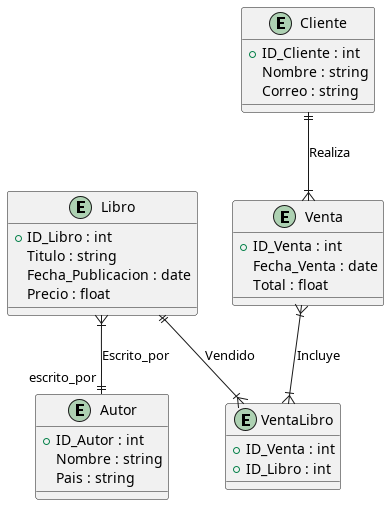
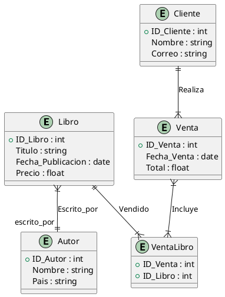

## La librería

Una librería quiere implementar un sistema para gestionar la información de sus libros, autores y ventas. La librería necesita tener la siguiente información:

1. **Libros**: Cada libro tiene un identificador único, un título, una fecha de publicación, y un precio. Cada libro puede ser escrito por uno o varios autores.
2. **Autores**: Cada autor tiene un identificador único, nombre y país de origen.
3. **Ventas**: La librería desea registrar cada venta realizada, incluyendo la fecha de venta, el cliente que realizó la compra, y el total de la venta. Un cliente puede comprar uno o varios libros en una misma venta, y cada venta tiene un identificador único.
4. **Clientes**: La librería necesita la información básica de los clientes: identificador único, nombre y correo electrónico.

**Relaciones:**
- Un libro puede tener múltiples autores (relación "escrito_por").
- Un autor puede haber escrito múltiples libros.
- Una venta puede incluir varios libros (relación "incluye").
- Un cliente puede realizar múltiples ventas.

Modelar las entidades, sus atributos, y relaciones usando un diagrama entidad-relación.

---

### Solución 

### Explicación

- **Entidad "Libro"** y **Entidad "Autor"** tienen una relación muchos-a-muchos ("escrito_por") entre ellos.
- **Entidad "Venta"** y **Entidad "Cliente"** tienen una relación uno-a-muchos, ya que un cliente puede realizar varias ventas.
- **Entidad "Venta"** y **Entidad "Libro"** se relacionan a través de la entidad **"VentaLibro"** para registrar múltiples libros en una misma venta.

