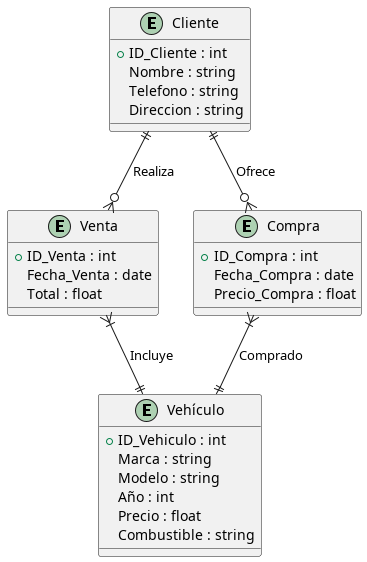
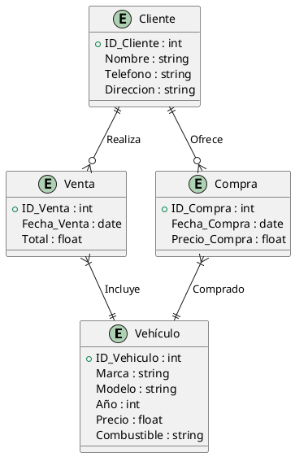

## Compra-Venta Coches 

Una agencia de vehículos quiere implementar un sistema para gestionar la compra y venta de autos. La agencia necesita registrar la siguiente información:

1. **Vehículos**: Cada vehículo tiene un identificador único, marca, modelo, año, precio y tipo de combustible.
2. **Clientes**: Los clientes que compran o venden vehículos tienen un identificador único, nombre, número de teléfono y dirección.
3. **Ventas**: Cada venta realizada tiene una fecha de venta, el monto total de la venta y el cliente que realiza la compra.
4. **Compras**: Cada compra de un vehículo a un cliente tiene una fecha de compra, precio de compra y cliente que realiza la venta.

**Relaciones**:
- Un cliente puede vender varios vehículos a la agencia, pero un vehículo sólo puede ser vendido una vez.
- Un cliente puede comprar múltiples vehículos, pero cada venta es independiente.
- Cada vehículo puede estar en una de las transacciones (compra o venta).

### Solución

### Explicación

- **Entidad "Vehículo"** se conecta a **"Venta"** y **"Compra"** para diferenciar entre cuando un vehículo es comprado por la agencia o vendido a un cliente.
- **Entidad "Cliente"** está relacionada con **"Venta"** y **"Compra"** para reflejar la transacción correspondiente (compra o venta).
- Las relaciones aseguran que un cliente pueda realizar varias ventas o compras, pero cada vehículo sólo estará en una transacción a la vez, de compra o venta.