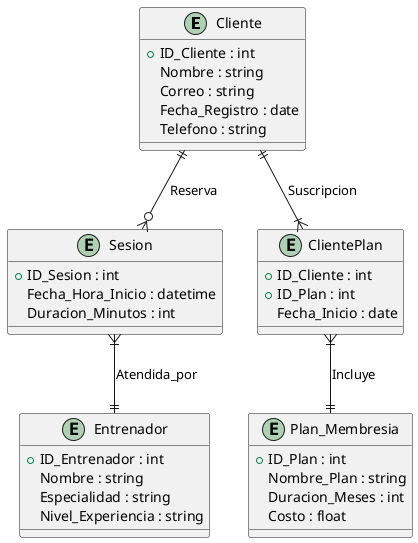

## Cadena de Gimnasios

Una cadena de gimnasios desea organizar la información de sus **Clientes**, **Entrenadores**, **Planes de Membresía** y las **Sesiones** que los clientes reservan. Las especificaciones son las siguientes:

1. **Cliente**:
   - Cada cliente tiene un **ID único**.
   - Se almacenan su **nombre**, **correo electrónico**, **fecha de registro** y **número de teléfono**.

2. **Entrenador**:
   - Cada entrenador tiene un **ID único**.
   - Se guardan su **nombre**, **especialidad** (como pesas, cardio, yoga, etc.) y su **nivel de experiencia**.

3. **Plan de Membresía**:
   - Cada plan tiene un **ID único**.
   - Los planes incluyen un **nombre del plan** (por ejemplo, "Mensual Básico", "Anual Premium"), una **duración en meses**, y el **costo**.

4. **Sesión**:
   - Cada sesión tiene un **ID único**, una **fecha y hora de inicio**, y una **duración en minutos**.
   - Un cliente puede reservar varias sesiones, pero cada sesión tiene solo un cliente y un entrenador asignado.

5. **Relaciones**:
   - Cada **Cliente** puede tener uno o más **Planes de Membresía**. Un cliente puede suscribirse a múltiples planes a lo largo del tiempo.
   - Cada **Cliente** puede reservar varias **Sesiones**.
   - Cada **Sesión** es atendida por un solo **Entrenador**.

Modela este sistema y asegúrate de reflejar correctamente las relaciones y atributos.

---

### Solución

Modelo ER:

### Explicación

- La **entidad Cliente** contiene información sobre cada cliente registrado en el gimnasio.
- La **entidad Entrenador** almacena datos sobre los entrenadores, incluidos sus nombres, especialidades y experiencia.
- La **entidad Plan_Membresia** representa los diferentes planes de suscripción que un cliente puede elegir.
- La **entidad Sesion** representa cada sesión reservada en el gimnasio.
- La **entidad ClientePlan** es una entidad de unión para rastrear la suscripción de cada cliente a planes específicos, permitiendo múltiples registros a lo largo del tiempo.
- 