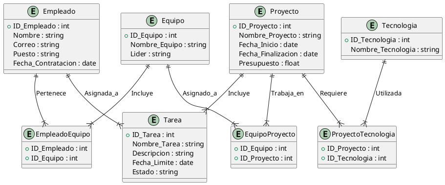

## Proyectos software

Una empresa de desarrollo de software necesita un sistema para organizar su información sobre **Proyectos**, **Empleados**, **Tareas** asignadas, **Equipos** de trabajo y **Tecnologías** utilizadas. Las especificaciones son las siguientes:

1. **Proyecto**:
   - Cada proyecto tiene un **ID único**.
   - Se guarda el **nombre del proyecto**, la **fecha de inicio**, la **fecha de finalización** y el **presupuesto**.
   - Cada proyecto puede requerir varias **Tecnologías** (como Python, JavaScript, SQL, etc.).

2. **Empleado**:
   - Cada empleado tiene un **ID único**.
   - Se guardan su **nombre**, **correo electrónico**, **puesto** (por ejemplo, desarrollador, gerente de proyecto, diseñador), y **fecha de contratación**.

3. **Equipo**:
   - Cada equipo tiene un **ID único**.
   - Cada equipo tiene un **nombre** y un **líder de equipo**.
   - Un equipo puede trabajar en múltiples proyectos a la vez, y cada proyecto puede tener varios equipos.

4. **Tarea**:
   - Cada tarea tiene un **ID único** y está vinculada a un proyecto.
   - Se registran el **nombre de la tarea**, la **descripción**, la **fecha límite** y el **estado** (pendiente, en progreso, completado).
   - Cada tarea debe asignarse a un **Empleado** específico.

5. **Tecnología**:
   - Cada tecnología tiene un **ID único** y un **nombre** (como Java, Python, SQL).

6. **Relaciones**:
   - Cada **Proyecto** puede requerir varias **Tecnologías**, y cada **Tecnología** puede usarse en múltiples **Proyectos**.
   - Cada **Empleado** pertenece a un único **Equipo**, y cada **Equipo** puede incluir múltiples **Empleados**.
   - Cada **Tarea** pertenece a un **Proyecto** específico y está asignada a un único **Empleado**.
   - Cada **Equipo** puede trabajar en varios **Proyectos** a la vez, y cada **Proyecto** puede tener varios **Equipos** asignados.

### Solución

Solución al problema: 

### Explicación

- **Proyecto** contiene información sobre los proyectos de la empresa.
- **Empleado** almacena datos sobre los empleados, incluidos sus puestos y fechas de contratación.
- **Equipo** representa los equipos que trabajan en diferentes proyectos y puede tener un líder de equipo.
- **Tarea** representa cada tarea dentro de un proyecto y está asignada a un empleado.
- **Tecnologia** contiene las tecnologías que la empresa utiliza.
- **ProyectoTecnologia** es una tabla de unión que representa la relación de muchos-a-muchos entre **Proyecto** y **Tecnología**.
- **EquipoProyecto** representa la relación de muchos-a-muchos entre **Equipo** y **Proyecto**.
- **EmpleadoEquipo** representa la relación de muchos-a-muchos entre **Empleado** y **Equipo**.

