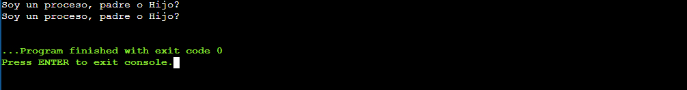
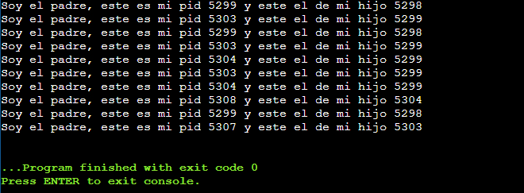

# Práctica 1

## Ejemplo 1;

```C
#include <stdio.h>
#include <unistd.h>

int main()
{
    fork();
    printf("Soy un proceso, padre o Hijo?");

    return 0;
}
```




## Ejemplo 2;

```C
#include <stdio.h>
#include <unistd.h>

int main()
{
    pid_t pid;
    fork();

    switch(pid) {
        case 0:
            printf("Soy el padre, este es mi pid %d y este el de mi hijo %d\n", getpid(), getppid());
            break;
        default:
            printf("Soy el hijo, este es mi pid %d y este el de mi padre %d\n", getppid(), getpid());
            break;
    }

    fork();

    switch(pid) {
        case 0:
            printf("Soy el padre, este es mi pid %d y este el de mi hijo %d\n", getpid(), getppid());
            break;
        default:
            printf("Soy el hijo, este es mi pid %d y este el de mi padre %d\n", getppid(), getpid());
            break;
    }

    fork();

    switch(pid) {
        case 0:
            printf("Soy el padre, este es mi pid %d y este el de mi hijo %d\n", getpid(), getppid());
            break;
        default:
            printf("Soy el hijo, este es mi pid %d y este el de mi padre %d\n", getppid(), getpid());
            break;
    }

    return 0;
}

```


